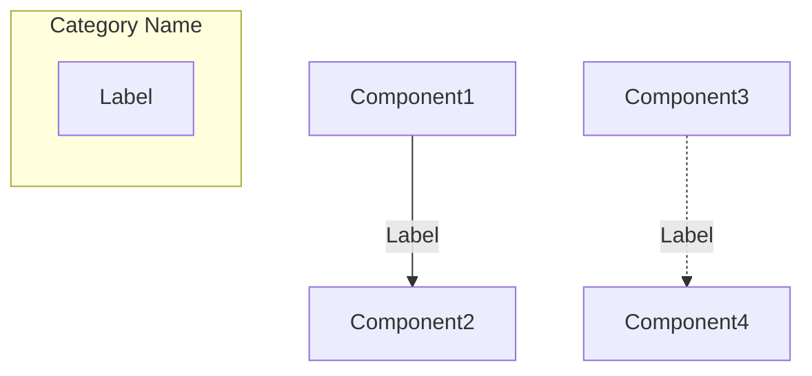

# Agent Modification Log: 2025.11.25-07_architecture-diagram

## Date
2025-11-25

## Summary
Ajout d'un diagramme UML architectural en Mermaid dans la page principale de la documentation pour illustrer l'architecture en couches (layers) de HELIOS et les flux de données entre composants.

## Files Modified

### Documentation
- `docs/index.md`
  - Ajout d'une section "Architecture Overview" avec diagramme Mermaid
  - Diagramme flowchart montrant tous les types de layers et leurs interactions
  - Légende explicative des concepts clés (sequential processing, parallel processing, orchestration)

### Configuration
- `docs/conf.py`
  - Ajout de l'extension `sphinxcontrib.mermaid` dans la liste des extensions Sphinx
  - Permet le rendu des diagrammes Mermaid dans la documentation HTML

### Dependencies
- Installation de `sphinxcontrib-mermaid==1.2.2` dans l'environnement virtuel

## Diagramme Créé

### Structure du Diagramme
Le diagramme UML flowchart représente 5 catégories de composants:

1. **Context (Orchestrator)** - Rose
   - `observe()` : méthode principale d'orchestration

2. **Scene Layer** - Beige/Orange
   - ⭐ Star (étoiles)
   - 🪐 Planet (planètes)
   - Zodiacal (lumière zodiacale)
   - ExoZodiacal (poussière exozodiacale)

3. **Optical Layers** - Bleu clair
   - 🔭 Collectors (ouvertures de télescope)
   - ◯ Pupil (géométrie d'ouverture)
   - 🌫️ Atmosphere (turbulence atmosphérique)
   - ✱ Coronagraph (suppression de lumière stellaire)
   - 🔄 AdaptiveOptics (correction de front d'onde)
   - ⚡ BeamSplitter (séparation de faisceaux)

4. **Photonic Layers** - Violet
   - 💎 PhotonicChip (circuits photoniques intégrés)
   - TOPS (three-output pupil slicer)
   - MMI (multi-mode interferometer)

5. **Detector Layers** - Vert
   - 📷 Camera (couche terminale produisant ndarray)

### Types de Connexions
- **Flèches solides** (`-->`) : Propagation séquentielle du wavefront
  - Exemple: `Scene --> Collectors --> Atmosphere --> Pupil --> Coronagraph`
  
- **Flèches pointillées** (`-.->`) : Orchestration par le Context
  - Le Context gère toutes les couches mais ne transforme pas le signal
  
- **Branches parallèles** : Après BeamSplitter
  - Un chemin vers Photonics
  - Un chemin direct vers Camera

### Éléments Visuels
- **Emojis** : Identification visuelle rapide des composants (🔭, 🌫️, 📷, etc.)
- **Couleurs de fond** : Catégorisation par type de layer
- **Labels descriptifs** : Rôle de chaque composant entre parenthèses
- **Résultat final** : Box jaune montrant le ndarray de sortie

## Concepts Documentés

### Key Concepts (Légende)
1. **Sequential Processing** : Flèches solides montrant le chemin de propagation
2. **Parallel Processing** : Branches multiples après BeamSplitter
3. **Context Orchestration** : Lignes pointillées montrant la gestion globale
4. **Terminal Layer** : Camera produit la sortie finale (numpy array)

### Flux de Données Typique
```
Scene (objets célestes)
  ↓ Wavefront
Collectors (collecte de lumière)
  ↓ Wavefront
Atmosphere (turbulence)
  ↓ Wavefront
Pupil (masque d'ouverture)
  ↓ Wavefront
Coronagraph (suppression stellaire)
  ↓ Wavefront
AdaptiveOptics (correction)
  ↓ Wavefront
BeamSplitter (division)
  ↓↓ Split Beams
  ├→ Photonics → Camera
  └→ Camera (direct)
    ↓ ndarray
  Final Image
```

## Technical Implementation

### Mermaid Syntax Used


### Rendering
- Mermaid diagrammes sont rendus côté client via JavaScript
- Sphinx génère le code Mermaid dans le HTML
- Le navigateur exécute mermaid.js pour créer le SVG

### Customization
- `style Category fill:#color` : Couleurs de fond personnalisées
- Direction: `TB` (top-to-bottom), `LR` (left-to-right)
- Emojis Unicode intégrés dans les labels

## Build Process

### Commands
```bash
cd d:\HELIOS\docs
.\make.bat html
```

### Output
- Documentation HTML avec diagramme interactif
- 16 warnings (unchanged, formatage de docstrings)
- Diagramme rendu avec succès dans `_build/html/index.html`

## Educational Value

### Avantages Pédagogiques
1. **Visualisation immédiate** : Comprendre l'architecture en un coup d'œil
2. **Identification des composants** : Emojis et couleurs facilitent la mémorisation
3. **Flux de données clair** : Flèches montrant comment le signal se propage
4. **Catégorisation** : Regroupement par fonction (scène, optique, photonique, détecteur)

### Public Cible
- **Nouveaux utilisateurs** : Comprendre rapidement l'organisation du package
- **Scientifiques non-experts** : Vue d'ensemble sans détails techniques
- **Développeurs** : Architecture pour contribuer de nouveaux layers
- **Étudiants** : Support visuel pour l'apprentissage

## Alignment with Project Philosophy

### Scientific Rigor ✅
- Diagramme fidèle à l'architecture réelle du code
- Terminologie correcte (Wavefront, Context, Layer)
- Flux de données physiquement cohérent

### Educational Clarity ✅
- Simplification visuelle sans perte d'information
- Légende explicative des concepts clés
- Emojis pour identification intuitive

### Documentation Quality ✅
- Intégration native dans Sphinx (pas d'image externe)
- Source versionnable (texte Mermaid, pas binaire)
- Responsive et accessible

## Future Enhancements (Recommendations)
1. **Diagramme interactif** : Liens cliquables vers pages de documentation de chaque composant
2. **Variantes du diagramme** : 
   - Diagramme simplifié pour débutants
   - Diagramme détaillé avec sous-composants
3. **Animation** : Montrer le flux de données en mouvement
4. **Exemples de pipelines** : Diagrammes pour cas d'usage spécifiques (coronagraphy, interferometry)
5. **Diagramme de classes UML** : Relations d'héritage entre Layer et sous-classes

## Testing
- ✅ Build Sphinx réussi
- ✅ Diagramme rendu dans HTML
- ✅ Emojis affichés correctement
- ✅ Couleurs appliquées aux subgraphs
- ✅ Flèches et labels lisibles
