# HELIOS - Architecture Détaillée (Diagramme UML de Classes)

Ce document présente l'architecture détaillée du package HELIOS sous forme de diagramme UML de classes, montrant toutes les classes, leurs attributs, méthodes et interactions.

## Vue d'ensemble de l'architecture

HELIOS est organisé en deux modules principaux :
- **`core`** : Classes de base définissant la structure de simulation
- **`components`** : Composants optiques et astronomiques spécifiques

```mermaid
classDiagram
    %% ============================================
    %% CORE CLASSES - Base Architecture
    %% ============================================
    
    class Wavefront {
        +Quantity wavelength
        +ndarray field
        +Quantity pixel_scale
        +__init__(wavelength, size)
        +propagate(distance)
    }
    
    class Element {
        <<abstract>>
        +str name
        +Layer layer
        +Context context
        +__init__(name)
        +description(indent, full) str
        +_get_detailed_attributes() dict
        +process(wavefront, context)* Wavefront
    }
    
    class Layer {
        <<abstract>>
        +str name
        +List~Element~ elements
        +Context context
        +__init__(name)
        +add_element(element)
        +description(indent, full) str
        +_get_detailed_attributes() dict
        +process(wavefront, context)* Wavefront
    }
    
    class Context {
        +List layers
        +Any date
        +Any declination
        +Quantity time
        +__init__(date, declination, **kwargs)
        +add_layer(layer)
        +observe(wavelength, size, **kwargs) Any
        +description(full) str
        +plot_architecture(filename, show_elements)
        +_build_graphviz_tree()
    }
    
    class Simulation {
        <<utility>>
    }
    
    %% Relationships - Core
    Context "1" *-- "0..*" Layer : contains
    Layer "1" *-- "0..*" Element : contains
    Element ..> Wavefront : processes
    Layer ..> Wavefront : processes
    Element --> Layer : belongs to
    Element --> Context : references
    Layer --> Context : belongs to
    
    %% ============================================
    %% SCENE COMPONENTS - Celestial Objects
    %% ============================================
    
    class CelestialBody {
        <<abstract>>
        +Tuple position
        +__init__(position, name, **kwargs)
        +process(wavefront, context) Wavefront
        +sed(wavelengths, **kwargs) Tuple
        +flux_at(wavelength, **kwargs) Quantity
        +plot_sed(wavelengths, ax, label, color, **kwargs)
    }
    
    class Star {
        +Quantity temperature
        +float magnitude
        +Quantity mass
        +__init__(temperature, magnitude, mass, **kwargs)
        +sed(wavelengths, **kwargs) Tuple
        +_get_detailed_attributes() dict
    }
    
    class Planet {
        +Quantity mass
        +Quantity radius
        +Quantity temperature
        +float albedo
        +float reflection_ratio
        +Scene scene
        +__init__(mass, radius, temperature, albedo, **kwargs)
        +sed(wavelengths, temperature, include_reflection, **kwargs) Tuple
        +_get_detailed_attributes() dict
    }
    
    class ZodiacalLight {
        +Quantity temperature
        +float brightness
        +__init__(temperature, brightness, **kwargs)
        +sed(wavelengths, **kwargs) Tuple
        +_get_detailed_attributes() dict
    }
    
    class LocalZodi {
        +Quantity temperature
        +float brightness
        +__init__(temperature, brightness, **kwargs)
        +sed(wavelengths, **kwargs) Tuple
        +_get_detailed_attributes() dict
    }
    
    class ExoZodi {
        +Quantity temperature
        +float brightness
        +__init__(temperature, brightness, **kwargs)
        +sed(wavelengths, **kwargs) Tuple
        +_get_detailed_attributes() dict
    }
    
    class Scene {
        +Quantity distance
        +List~CelestialBody~ bodies
        +__init__(distance, name)
        +add_body(body)
        +add_star(**kwargs) Star
        +add_planet(**kwargs) Planet
        +add_local_zodi(**kwargs) LocalZodi
        +add_exo_zodi(**kwargs) ExoZodi
        +plot(ax, unit, center_on_star, **kwargs)
        +process(wavefront, context) Wavefront
        +_get_detailed_attributes() dict
    }
    
    %% Relationships - Scene
    CelestialBody --|> Element
    Star --|> CelestialBody
    Planet --|> CelestialBody
    ZodiacalLight --|> CelestialBody
    LocalZodi --|> ZodiacalLight
    ExoZodi --|> ZodiacalLight
    Scene --|> Layer
    Scene "1" *-- "0..*" CelestialBody : contains
    Planet --> Scene : references
    
    %% ============================================
    %% COLLECTOR COMPONENTS - Telescopes
    %% ============================================
    
    class Pupil {
        +Quantity diameter
        +List primitives
        +__init__(diameter)
        +add_disk(radius, center, value)
        +add_hexagon(radius, center, value, rotation)
        +add_central_obscuration(diameter)
        +add_spiders(arms, width, angle, angles)
        +add_segmented_primary(seg_flat, rings, rotation, gap)
        +get_array(npix, soft, oversample) ndarray
        +plot(npix, soft, oversample, ax, cmap)
        +diffraction_pattern(npix, soft, oversample, wavelength) ndarray
        +plot_diffraction_pattern(npix, soft, oversample, ax, **kwargs)
        +image_through_pupil(scene_array, soft, oversample, normalize) ndarray
        +plot_image_through_pupil(scene_array, soft, oversample, ax, **kwargs)
        +jwst()$ Pupil
        +vlt()$ Pupil
        +elt()$ Pupil
        +like(name)$ Pupil
    }
    
    class Collector {
        +Pupil pupil
        +Tuple position
        +Quantity size
        +dict metadata
        +__init__(pupil, position, size, name, **metadata)
        +process(wavefront, context) Wavefront
        +_get_detailed_attributes() dict
    }
    
    class TelescopeArray {
        +Quantity latitude
        +Quantity longitude
        +Quantity altitude
        +List~Collector~ elements
        +__init__(name, latitude, longitude, altitude)
        +collectors() List~Collector~
        +add_collector(pupil, position, size, name, **kwargs)
        +is_interferometric() bool
        +get_baseline_array() ndarray
        +plot_array(ax, show_pupils, pupil_scale)
        +vlti(uts)$ TelescopeArray
        +life()$ TelescopeArray
        +_get_detailed_attributes() dict
    }
    
    %% Relationships - Collectors
    Collector --|> Element
    TelescopeArray --|> Layer
    Collector "1" *-- "1" Pupil : has
    TelescopeArray "1" *-- "1..*" Collector : contains
    
    %% ============================================
    %% ATMOSPHERE & ADAPTIVE OPTICS
    %% ============================================
    
    class Atmosphere {
        +Quantity rms
        +Quantity wind_speed
        +float wind_direction
        +int seed
        +Quantity inner_scale
        +Quantity outer_scale
        +ndarray _frozen_screen
        +int _screen_size
        +__init__(rms, wind_speed, wind_direction, seed, **kwargs)
        +_generate_frozen_screen(N, oversample) ndarray
        +_extract_screen_at_time(time, N) ndarray
        +process(wavefront, context) Wavefront
        +plot_screen_animation(collectors, wavelength, **kwargs)
        +plot_animation(collectors, wavelength, **kwargs)
    }
    
    class AdaptiveOptics {
        +dict coeffs
        +bool normalize
        +__init__(coeffs, normalize, name)
        +noll_to_nm(j)$ Tuple
        +_radial_polynomial(n, m, r) ndarray
        +_zernike_nm(n, m, rho, theta) ndarray
        +process(wavefront, context) Wavefront
    }
    
    %% Relationships - Atmosphere
    Atmosphere --|> Element
    AdaptiveOptics --|> Element
    
    %% ============================================
    %% CORONAGRAPH
    %% ============================================
    
    class Coronagraph {
        +str phase_mask
        +__init__(phase_mask, name)
        +process(wavefront, context) Wavefront
        +mask_array(npix, kind, charge, lam, diameter, fov) ndarray
        +plot_mask(npix, kind, charge, ax, **kwargs)
        +image_from_scene(scene_array, soft, oversample, **kwargs) ndarray
        +plot_image_from_scene(scene_array, ax, **kwargs)
    }
    
    %% Relationships - Coronagraph
    Coronagraph --|> Element
    
    %% ============================================
    %% DETECTOR
    %% ============================================
    
    class Camera {
        +Tuple pixels
        +Quantity dark_current
        +Quantity read_noise
        +Quantity integration_time
        +float quantum_efficiency
        +float gain
        +Quantity thermal_background
        +Quantity thermal_background_temp
        +__init__(pixels, dark_current, read_noise, **kwargs)
        +get_raw_image(wavefront, context) ndarray
        +get_dark() ndarray
        +get_image(wavefront, context, subtract_dark) ndarray
        +process(wavefront, context) ndarray
        +_get_detailed_attributes() dict
    }
    
    %% Relationships - Camera
    Camera --|> Element
    
    %% ============================================
    %% BEAM SPLITTING
    %% ============================================
    
    class BeamSplitter {
        +float cutoff
        +__init__(cutoff, name)
        +process(wavefront, context) List~Wavefront~
        +_get_detailed_attributes() dict
    }
    
    %% Relationships - BeamSplitter
    BeamSplitter --|> Element
    
    %% ============================================
    %% FIBER OPTICS
    %% ============================================
    
    class FiberIn {
        +int modes
        +__init__(modes, **kwargs)
        +process(wavefront, context) Wavefront
    }
    
    class FiberOut {
        +__init__(**kwargs)
        +process(wavefront, context) Wavefront
    }
    
    %% Relationships - Fibers
    FiberIn --|> Layer
    FiberOut --|> Layer
    
    %% ============================================
    %% PHOTONIC INTEGRATED CIRCUITS
    %% ============================================
    
    class PhotonicChip {
        +int inputs
        +Quantity lambda0
        +List~Layer~ layers
        +__init__(inputs, lambda0, **kwargs)
        +add_layer(layer)
        +process(wavefronts, context) List~Wavefront~
    }
    
    class TOPS {
        +Union on_paths
        +__init__(on_paths)
        +process(wavefronts, context) List~Wavefront~
    }
    
    class MMI {
        +ndarray matrix
        +__init__(matrix)
        +process(wavefronts, context) List~Wavefront~
    }
    
    %% Relationships - Photonics
    PhotonicChip --|> Layer
    TOPS --|> Layer
    MMI --|> Layer
    PhotonicChip "1" *-- "0..*" Layer : contains
```



## Description des modules

### Module `core`

#### `Wavefront`
Représente le champ électromagnétique complexe (amplitude et phase) à une longueur d'onde donnée. C'est l'objet principal qui circule à travers la chaîne de simulation.

**Attributs clés :**
- `wavelength` : Longueur d'onde de la lumière
- `field` : Tableau 2D complexe représentant l'amplitude et la phase
- `pixel_scale` : Échelle physique par pixel

#### `Element`
Classe de base abstraite pour tous les composants physiques individuels. Chaque élément peut traiter un front d'onde indépendamment.

**Méthodes clés :**
- `process(wavefront, context)` : Méthode abstraite à implémenter par les sous-classes
- `description()` : Génère une description textuelle de l'élément

#### `Layer`
Classe de base abstraite pour les groupes logiques d'éléments. Une couche peut contenir plusieurs éléments qui traitent les fronts d'onde en parallèle.

**Méthodes clés :**
- `add_element(element)` : Ajoute un élément à la couche
- `process(wavefront, context)` : Traite le front d'onde à travers tous les éléments

#### `Context`
Orchestrateur principal de la simulation. Gère la séquence de couches et l'exécution de l'observation.

**Méthodes clés :**
- `add_layer(layer)` : Ajoute une couche à la simulation
- `observe(wavelength, size)` : Exécute la simulation complète
- `plot_architecture()` : Visualise l'architecture de la simulation

### Module `components`

#### Scène astronomique

**`Scene`** : Couche contenant tous les objets célestes
- Gère la distance au système stellaire
- Contient des étoiles, planètes, et lumière zodiacale

**`CelestialBody`** : Classe de base pour tous les objets célestes
- `sed()` : Calcule la distribution spectrale d'énergie
- `flux_at()` : Calcule le flux à une longueur d'onde spécifique

**`Star`** : Étoile avec spectre de corps noir
- Température, magnitude, masse

**`Planet`** : Planète avec émission thermique et réflexion stellaire
- Masse, rayon, température, albédo
- Calcul automatique de la réflexion de la lumière stellaire

**`ZodiacalLight`**, **`LocalZodi`**, **`ExoZodi`** : Lumière zodiacale (locale et exo-zodiacale)

#### Collecteurs de lumière

**`Pupil`** : Géométrie d'ouverture optique
- Construction par primitives (disques, hexagones, araignées)
- Calcul de patron de diffraction
- Presets : JWST, VLT, ELT

**`Collector`** : Télescope individuel
- Associe une pupille à une position spatiale
- Applique le masque de pupille au front d'onde

**`TelescopeArray`** : Réseau de télescopes
- Gestion de configurations interférométriques
- Presets : VLTI, LIFE

#### Atmosphère et optique adaptative

**`Atmosphere`** : Turbulence atmosphérique de Kolmogorov
- Écrans de phase avec évolution temporelle (frozen-flow)
- Paramètres : RMS, vitesse du vent, échelles interne/externe

**`AdaptiveOptics`** : Correction par optique adaptative
- Correction basée sur les polynômes de Zernike
- Coefficients de Zernike (n,m) ou indices de Noll

#### Imagerie à haut contraste

**`Coronagraph`** : Masques coronographiques
- Types : 4 quadrants, vortex, Lyot
- Suppression de la lumière stellaire sur l'axe

#### Détection

**`Camera`** : Détecteur avec bruit réaliste
- Courant d'obscurité, bruit de lecture
- Fond thermique, efficacité quantique
- Méthodes : `get_raw_image()`, `get_dark()`, `get_image()`

#### Division de faisceau

**`BeamSplitter`** : Diviseur de faisceau optique
- Divise un front d'onde en plusieurs chemins
- Paramètre de transmission/réflexion

#### Photonique intégrée

**`FiberIn`** / **`FiberOut`** : Couplage fibré
- Entrée/sortie de fibres optiques
- Modes simples ou multiples

**`PhotonicChip`** : Circuit photonique intégré
- Contient des couches de composants photoniques
- **`TOPS`** : Déphaseur thermo-optique
- **`MMI`** : Coupleur multi-mode (matrice de couplage)

## Relations et flux de données

### Hiérarchie d'héritage

```
Element (abstract)
├── CelestialBody (abstract)
│   ├── Star
│   ├── Planet
│   └── ZodiacalLight
│       ├── LocalZodi
│       └── ExoZodi
├── Collector
├── Atmosphere
├── AdaptiveOptics
├── Coronagraph
├── Camera
└── BeamSplitter

Layer (abstract)
├── Scene
├── TelescopeArray
├── FiberIn
├── FiberOut
├── PhotonicChip
├── TOPS
└── MMI
```

### Composition

- **Context** contient des **Layers**
- **Layer** contient des **Elements**
- **Scene** contient des **CelestialBodies**
- **TelescopeArray** contient des **Collectors**
- **Collector** contient un **Pupil**
- **PhotonicChip** contient des **Layers** photoniques

### Flux de traitement

1. **Context.observe()** initialise un **Wavefront**
2. Le **Wavefront** passe séquentiellement à travers chaque **Layer**
3. Chaque **Layer** applique ses **Elements** au **Wavefront**
4. Le résultat final est retourné (image, intensité, etc.)

### Exemple de chaîne typique

```
Scene → TelescopeArray → Atmosphere → AdaptiveOptics → Coronagraph → Camera
```

Chaque composant transforme le front d'onde selon ses propriétés physiques, permettant une simulation end-to-end réaliste d'observations astronomiques.

## Notes d'implémentation

- Les classes abstraites (`Element`, `Layer`) définissent l'interface commune
- Toutes les classes héritant de `Element` ou `Layer` doivent implémenter `process()`
- Les références bidirectionnelles (`Element.layer`, `Layer.context`) permettent l'accès au contexte global
- Les méthodes `_get_detailed_attributes()` permettent la génération de descriptions détaillées
- Les méthodes statiques (marquées `$`) sont des factory methods pour créer des configurations prédéfinies
